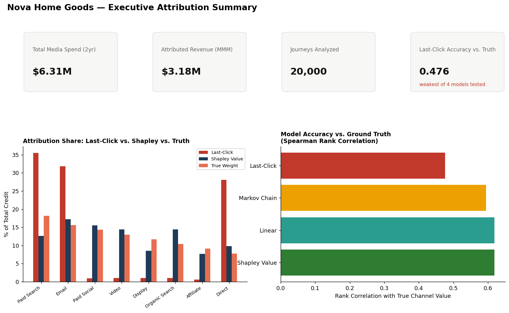
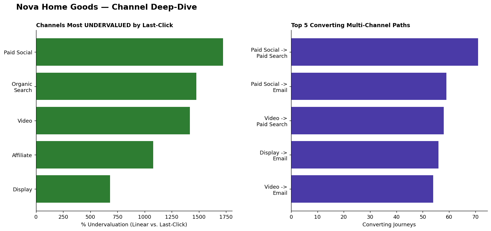
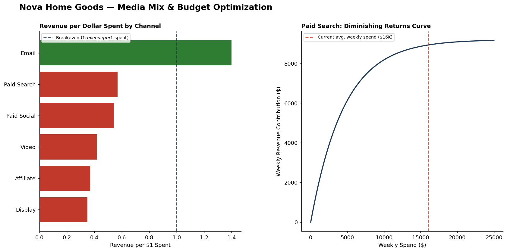
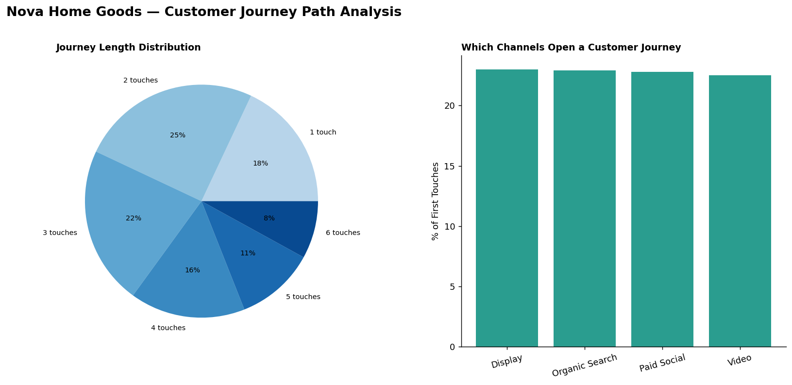

# Nova Home Goods — Marketing Attribution & Media Mix Modeling


## Research Question

Nova Home Goods evaluates its marketing channels using last-click
attribution, a method with well-documented limitations: it credits only the
final touchpoint in a customer's journey, systematically over-valuing
channels that tend to close a purchase and under-valuing channels that
generate initial awareness. This project asks whether more rigorous
multi-touch attribution methods — specifically Markov chain removal-effect
modeling and exact Shapley Value attribution — recover a more accurate
picture of channel value, and quantifies the answer directly against a known
ground truth rather than asserting it.

## Data & Methodology

This dataset is synthetic, and deliberately so: the true per-touch
effectiveness of each of the eight marketing channels was programmed in
advance, allowing every attribution model evaluated in this analysis to be
checked against a known quantity. Raw, multi-touch, user-level customer
journey data is not published by companies; this is disclosed as a
methodological necessity. The analysis comprises 20,000 customer journeys
(59,849 touchpoints) and 832 weekly channel-level media observations across
eight channels (2024-2025).

## Executive Attribution Summary



## Channel Deep-Dive



## Media Mix & Budget Optimization



## Customer Journey Path Analysis



## Principal Findings

1. **Last-click attribution exhibits the weakest correspondence with true
   channel value** of the four models evaluated (Spearman rank correlation
   = 0.476), versus 0.619 for both Linear and Shapley Value attribution and
   0.595 for Markov Chain attribution.
2. **Direct is materially overvalued under last-click attribution** (28.1%
   of credit vs. a 7.8% true share) — the largest discrepancy observed.
3. **Paid Social is the most severely undervalued channel** under
   last-click attribution, receiving 0.9% of credit versus a 14.3% true
   share.
4. **Shapley Value attribution satisfies its theoretical efficiency
   property exactly**: channel credits sum to total converted revenue
   ($306,126) to the cent, independently verifying correct implementation.
5. **Email is the only evaluated paid channel currently operating above
   revenue breakeven** ($1.40 revenue per dollar spent); Paid Search, the
   largest budget line item, returns only $0.57 per dollar spent.

*(The complete set of findings — 15 findings, 10 risks, 15 recommendations,
10 near-term actions, and 10 longer-term opportunities — is documented in
[`docs/business_insights.md`](docs/business_insights.md).)*

## Principal Recommendations

1. Discontinue last-click attribution as the primary basis for media
   budget allocation, given its demonstrated weakest correspondence with
   true channel value.
2. Reduce Paid Search spend toward its estimated point of efficient
   marginal return, reallocating the difference toward undervalued
   upper-funnel channels.
3. Increase investment in Paid Social specifically, given both its
   substantial undervaluation and its favorable position on its estimated
   response curve.

## Excel Dashboard


Pivot-style summaries, conditional formatting, and VLOOKUP/INDEX-MATCH
lookups are documented in
[`Excel/nova_attribution_dashboard.xlsx`](Excel/nova_attribution_dashboard.xlsx).

## Limitations

A complete discussion appears in
[`docs/business_insights.md`](docs/business_insights.md); principal items:

- This dataset is synthetic by design, constructed to allow verification
  of attribution models against known ground truth.
- The touchpoint-level journey dataset and the weekly-aggregate media
  dataset were generated independently and are not designed to reconcile
  numerically — they represent two distinct analytical lenses, not two
  measurements of the same quantity.
- No model examined achieves perfect correspondence with ground truth; the
  tie between Shapley Value and Linear attribution should not be
  generalized without independent validation on other datasets.
- The path-sequencing findings are descriptive, not causal.

## Project Structure

| Directory | Contents |
|---|---|
| [`SQL/`](SQL) | Schema and 10 queries, including four attribution models (last-click, first-touch, linear, time-decay) and path/co-occurrence analysis |
| [`notebooks/`](notebooks) | Markov chain and exact Shapley Value attribution implemented from first principles, validated against ground truth |
| [`Excel/`](Excel) | KPI workbook with pivot-style summaries, conditional formatting, and VLOOKUP/INDEX-MATCH lookups |
| [`data/`](data) | Synthetic data generator with programmed ground truth |
| [`docs/`](docs) | Complete findings and recommendations report |

**Representative SQL** (linear attribution — full query in
[`SQL/02_analysis_queries.sql`](SQL/02_analysis_queries.sql)):
```sql
SELECT t.channel, SUM(j.revenue / j.num_touchpoints) AS revenue_credited
FROM fact_touchpoints t JOIN fact_journeys j ON j.journey_id = t.journey_id
WHERE j.converted = 1
GROUP BY t.channel
```

## Methods & Tools

SQL (window functions, common table expressions, string aggregation for
path analysis) · Statistical and game-theoretic methods (Markov chain
absorption probability, exact Shapley Value computation, Spearman rank
correlation) · Excel (pivot-style summaries, conditional formatting,
VLOOKUP/INDEX-MATCH) · Power BI dashboard design · media mix modeling
(response-curve estimation)

---

© 2026 Temaje Zakaria. All rights reserved.
